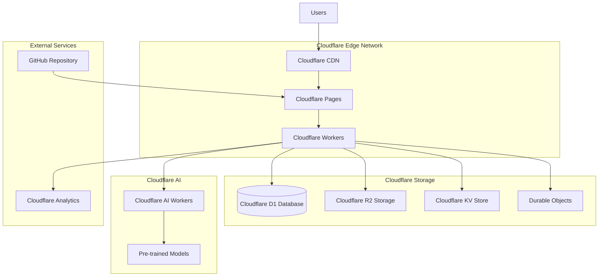

# Cloudflare Deployment Architecture

## 🌐 **CLOUDFLARE INFRASTRUCTURE OVERVIEW**

The CreateX Facilitator Guide will be deployed using Cloudflare's full-stack platform, leveraging:

- **Cloudflare Pages** - Static site hosting with edge deployment
- **Cloudflare Workers** - Serverless API endpoints
- **Cloudflare D1** - SQLite-based serverless database
- **Cloudflare R2** - Object storage for files and assets
- **Cloudflare AI** - AI/ML inference at the edge
- **Cloudflare KV** - Key-value store for caching and sessions
- **Cloudflare Durable Objects** - Stateful edge computing for real-time features

## 🏗️ **ARCHITECTURE DIAGRAM**



## 📊 **CLOUDFLARE SERVICES MAPPING**

### Current Architecture → Cloudflare Migration

| Current Component | Cloudflare Service | Purpose |
|------------------|-------------------|---------|
| Next.js App | Cloudflare Pages | Static site hosting |
| API Routes | Cloudflare Workers | Serverless API endpoints |
| File System Content | Cloudflare D1 + R2 | Database + file storage |
| In-Memory Cache | Cloudflare KV | Distributed caching |
| AI Integration | Cloudflare AI | Edge AI inference |
| Real-time Features | Durable Objects | Stateful connections |
| Asset Storage | Cloudflare R2 | CDN-integrated storage |

## 🛠️ **IMPLEMENTATION PLAN**

### Phase 1: Database Migration (Week 1)
**Migrate from file-based to Cloudflare D1**

#### 1.1 Database Schema Design
```sql
-- Content Management Tables
CREATE TABLE modules (
    id TEXT PRIMARY KEY,
    chapter INTEGER NOT NULL,
    title TEXT NOT NULL,
    description TEXT,
    content TEXT NOT NULL,
    track TEXT NOT NULL,
    difficulty TEXT NOT NULL,
    duration TEXT NOT NULL,
    learning_objectives TEXT, -- JSON array
    prerequisites TEXT, -- JSON array
    author TEXT,
    created_at DATETIME DEFAULT CURRENT_TIMESTAMP,
    updated_at DATETIME DEFAULT CURRENT_TIMESTAMP,
    published BOOLEAN DEFAULT FALSE,
    version INTEGER DEFAULT 1
);

-- Assessment System Tables
CREATE TABLE assessments (
    id TEXT PRIMARY KEY,
    module_id TEXT NOT NULL,
    title TEXT NOT NULL,
    description TEXT,
    type TEXT NOT NULL, -- quiz, assignment, project
    questions TEXT NOT NULL, -- JSON
    time_limit INTEGER, -- seconds
    passing_score INTEGER DEFAULT 70,
    max_attempts INTEGER DEFAULT 3,
    created_at DATETIME DEFAULT CURRENT_TIMESTAMP,
    FOREIGN KEY (module_id) REFERENCES modules(id)
);

CREATE TABLE assessment_attempts (
    id TEXT PRIMARY KEY,
    assessment_id TEXT NOT NULL,
    user_id TEXT NOT NULL,
    answers TEXT NOT NULL, -- JSON
    score INTEGER,
    passed BOOLEAN,
    time_spent INTEGER, -- seconds
    completed_at DATETIME DEFAULT CURRENT_TIMESTAMP,
    FOREIGN KEY (assessment_id) REFERENCES assessments(id)
);

-- User Progress Tracking
CREATE TABLE user_progress (
    id TEXT PRIMARY KEY,
    user_id TEXT NOT NULL,
    module_id TEXT NOT NULL,
    completed BOOLEAN DEFAULT FALSE,
    progress_percentage INTEGER DEFAULT 0,
    time_spent INTEGER DEFAULT 0, -- seconds
    last_accessed DATETIME DEFAULT CURRENT_TIMESTAMP,
    FOREIGN KEY (module_id) REFERENCES modules(id),
    UNIQUE(user_id, module_id)
);

-- Translation System
CREATE TABLE translations (
    id TEXT PRIMARY KEY,
    content_id TEXT NOT NULL,
    content_type TEXT NOT NULL, -- module, assessment, ui
    language TEXT NOT NULL,
    translated_content TEXT NOT NULL,
    translator TEXT, -- ai, human, community
    confidence REAL DEFAULT 1.0,
    created_at DATETIME DEFAULT CURRENT_TIMESTAMP,
    updated_at DATETIME DEFAULT CURRENT_TIMESTAMP
);

-- Analytics and Usage
CREATE TABLE analytics_events (
    id TEXT PRIMARY KEY,
    user_id TEXT,
    session_id TEXT,
    event_type TEXT NOT NULL,
    event_data TEXT, -- JSON
    timestamp DATETIME DEFAULT CURRENT_TIMESTAMP,
    ip_address TEXT,
    user_agent TEXT
);

-- AI Generated Content
CREATE TABLE ai_generated_content (
    id TEXT PRIMARY KEY,
    content_type TEXT NOT NULL, -- exercise, assessment, enhancement
    prompt TEXT NOT NULL,
    context TEXT, -- JSON
    generated_content TEXT NOT NULL,
    model_used TEXT,
    confidence REAL,
    human_reviewed BOOLEAN DEFAULT FALSE,
    created_at DATETIME DEFAULT CURRENT_TIMESTAMP
);
```

#### 1.2 Data Migration Script
```typescript
// scripts/migrate-to-d1.ts
import { contentManager } from '../lib/content';

interface CloudflareD1Database {
  prepare(query: string): D1PreparedStatement;
  batch(statements: D1PreparedStatement[]): Promise<D1Result[]>;
  exec(query: string): Promise<D1ExecResult>;
}

export async function migrateContentToD1(db: CloudflareD1Database) {
  console.log('Starting content migration to Cloudflare D1...');
  
  // Load existing modules from file system
  const modules = await contentManager.loadAllModules();
  
  const insertStatements = modules.map(module => {
    return db.prepare(`
      INSERT INTO modules (
        id, chapter, title, description, content, track, 
        difficulty, duration, learning_objectives, prerequisites,
        author, published
      ) VALUES (?, ?, ?, ?, ?, ?, ?, ?, ?, ?, ?, ?)
    `).bind(
      module.id,
      module.chapter,
      module.title,
      module.description || '',
      module.content,
      module.track,
      module.difficulty,
      module.duration,
      JSON.stringify(module.learningObjectives),
      JSON.stringify(module.prerequisites || []),
      module.metadata?.author || 'System',
      true
    );
  });
  
  await db.batch(insertStatements);
  console.log(`Migrated ${modules.length} modules to D1`);
}
```

### Phase 2: Worker API Development (Week 2)
**Replace Next.js API routes with Cloudflare Workers**

#### 2.1 Worker Structure
```typescript
// workers/api/src/index.ts
import { Router } from 'itty-router';
import { corsHeaders } from './utils/cors';
import { contentHandler } from './handlers/content';
import { assessmentHandler } from './handlers/assessments';
import { aiHandler } from './handlers/ai';
import { analyticsHandler } from './handlers/analytics';

const router = Router();

// CORS preflight
router.options('*', () => new Response(null, { headers: corsHeaders }));

// Content Management API
router.get('/api/content/modules', contentHandler.getModules);
router.get('/api/content/modules/:id', contentHandler.getModule);
router.post('/api/content/modules', contentHandler.createModule);
router.put('/api/content/modules/:id', contentHandler.updateModule);
router.delete('/api/content/modules/:id', contentHandler.deleteModule);
router.get('/api/content/search', contentHandler.searchContent);

// Assessment API
router.get('/api/assessments/modules/:moduleId', assessmentHandler.getAssessments);
router.post('/api/assessments/:assessmentId/attempts', assessmentHandler.submitAttempt);
router.get('/api/assessments/progress', assessmentHandler.getUserProgress);

// AI Services API
router.post('/api/ai/generate', aiHandler.generateContent);
router.post('/api/ai/enhance', aiHandler.enhanceContent);
router.post('/api/ai/translate', aiHandler.translateContent);

// Analytics API
router.post('/api/analytics/track', analyticsHandler.trackEvent);
router.get('/api/analytics/dashboard', analyticsHandler.getDashboard);

// Error handling
router.all('*', () => new Response('Not Found', { status: 404 }));

export interface Env {
  DB: D1Database;
  CONTENT_BUCKET: R2Bucket;
  CACHE: KVNamespace;
  AI: Ai;
  DURABLE_OBJECTS: DurableObjectNamespace;
}

export default {
  async fetch(request: Request, env: Env, ctx: ExecutionContext): Promise<Response> {
    return router.handle(request, env, ctx);
  }
};
```

#### 2.2 Content Handler Implementation
```typescript
// workers/api/src/handlers/content.ts
import { Env } from '../index';

export const contentHandler = {
  async getModules(request: Request, env: Env): Promise<Response> {
    const url = new URL(request.url);
    const lang = url.searchParams.get('lang') || 'en';
    const track = url.searchParams.get('track');
    const limit = parseInt(url.searchParams.get('limit') || '50');
    const offset = parseInt(url.searchParams.get('offset') || '0');

    let query = 'SELECT * FROM modules WHERE published = 1';
    const params: any[] = [];

    if (track) {
      query += ' AND track = ?';
      params.push(track);
    }

    query += ' ORDER BY chapter ASC LIMIT ? OFFSET ?';
    params.push(limit, offset);

    const { results } = await env.DB.prepare(query).bind(...params).all();
    
    // Check for translations
    const modules = await Promise.all(results.map(async (module: any) => {
      if (lang !== 'en') {
        const translation = await env.DB.prepare(
          'SELECT translated_content FROM translations WHERE content_id = ? AND language = ? AND content_type = "module"'
        ).bind(module.id, lang).first();
        
        if (translation) {
          const translatedData = JSON.parse(translation.translated_content);
          module = { ...module, ...translatedData };
        }
      }
      
      // Parse JSON fields
      module.learning_objectives = JSON.parse(module.learning_objectives || '[]');
      module.prerequisites = JSON.parse(module.prerequisites || '[]');
      
      return module;
    }));

    return new Response(JSON.stringify({ modules }), {
      headers: {
        'Content-Type': 'application/json',
        ...corsHeaders
      }
    });
  },

  async getModule(request: Request, env: Env): Promise<Response> {
    const url = new URL(request.url);
    const moduleId = url.pathname.split('/').pop();
    const lang = url.searchParams.get('lang') || 'en';

    // Try cache first
    const cacheKey = `module:${moduleId}:${lang}`;
    const cached = await env.CACHE.get(cacheKey);
    if (cached) {
      return new Response(cached, {
        headers: {
          'Content-Type': 'application/json',
          'Cache-Control': 'public, max-age=300',
          ...corsHeaders
        }
      });
    }

    const module = await env.DB.prepare(
      'SELECT * FROM modules WHERE id = ? AND published = 1'
    ).bind(moduleId).first();

    if (!module) {
      return new Response(JSON.stringify({ error: 'Module not found' }), {
        status: 404,
        headers: { 'Content-Type': 'application/json', ...corsHeaders }
      });
    }

    // Apply translation if needed
    if (lang !== 'en') {
      const translation = await env.DB.prepare(
        'SELECT translated_content FROM translations WHERE content_id = ? AND language = ? AND content_type = "module"'
      ).bind(moduleId, lang).first();
      
      if (translation) {
        const translatedData = JSON.parse(translation.translated_content);
        Object.assign(module, translatedData);
      }
    }

    // Parse JSON fields
    module.learning_objectives = JSON.parse(module.learning_objectives || '[]');
    module.prerequisites = JSON.parse(module.prerequisites || '[]');

    const response = JSON.stringify({ module });
    
    // Cache for 5 minutes
    await env.CACHE.put(cacheKey, response, { expirationTtl: 300 });

    return new Response(response, {
      headers: {
        'Content-Type': 'application/json',
        'Cache-Control': 'public, max-age=300',
        ...corsHeaders
      }
    });
  }
};
```

### Phase 3: Cloudflare AI Integration (Week 3)
**Implement AI features using Cloudflare AI Workers**

#### 3.1 AI Handler Implementation
```typescript
// workers/api/src/handlers/ai.ts
import { Env } from '../index';

export const aiHandler = {
  async generateContent(request: Request, env: Env): Promise<Response> {
    const { type, prompt, context } = await request.json();
    
    // Use Cloudflare AI for content generation
    const aiResponse = await env.AI.run('@cf/meta/llama-3.1-8b-instruct', {
      messages: [
        {
          role: 'system',
          content: 'You are an expert facilitator and instructional designer creating educational content for design thinking workshops.'
        },
        {
          role: 'user',
          content: `Generate ${type} content based on this prompt: ${prompt}\n\nContext: ${JSON.stringify(context)}`
        }
      ],
      max_tokens: 1000,
      temperature: 0.7
    });

    // Structure the response based on content type
    let structuredContent;
    switch (type) {
      case 'exercise':
        structuredContent = await generateExerciseStructure(aiResponse.response, env);
        break;
      case 'assessment':
        structuredContent = await generateAssessmentStructure(aiResponse.response, env);
        break;
      default:
        structuredContent = { content: aiResponse.response };
    }

    // Store generated content for review
    await env.DB.prepare(`
      INSERT INTO ai_generated_content (
        content_type, prompt, context, generated_content, model_used, confidence
      ) VALUES (?, ?, ?, ?, ?, ?)
    `).bind(
      type,
      prompt,
      JSON.stringify(context),
      JSON.stringify(structuredContent),
      '@cf/meta/llama-3.1-8b-instruct',
      0.85
    ).run();

    return new Response(JSON.stringify({
      generated: structuredContent,
      metadata: {
        model: '@cf/meta/llama-3.1-8b-instruct',
        timestamp: new Date().toISOString(),
        confidence: 0.85
      }
    }), {
      headers: {
        'Content-Type': 'application/json',
        ...corsHeaders
      }
    });
  },

  async translateContent(request: Request, env: Env): Promise<Response> {
    const { content, targetLanguage, sourceLanguage = 'en' } = await request.json();
    
    // Use Cloudflare AI for translation
    const translationResponse = await env.AI.run('@cf/meta/m2m100-1.2b', {
      text: content,
      source_lang: sourceLanguage,
      target_lang: targetLanguage
    });

    // Store translation for caching
    const translationId = crypto.randomUUID();
    await env.DB.prepare(`
      INSERT INTO translations (
        id, content_id, content_type, language, translated_content, translator, confidence
      ) VALUES (?, ?, ?, ?, ?, ?, ?)
    `).bind(
      translationId,
      'generated',
      'dynamic',
      targetLanguage,
      JSON.stringify({ content: translationResponse.translated_text }),
      'ai',
      translationResponse.confidence || 0.9
    ).run();

    return new Response(JSON.stringify({
      translation: {
        content: translationResponse.translated_text,
        confidence: translationResponse.confidence || 0.9
      },
      metadata: {
        sourceLanguage,
        targetLanguage,
        model: '@cf/meta/m2m100-1.2b',
        timestamp: new Date().toISOString()
      }
    }), {
      headers: {
        'Content-Type': 'application/json',
        ...corsHeaders
      }
    });
  },

  async enhanceContent(request: Request, env: Env): Promise<Response> {
    const { content, enhancements, context } = await request.json();
    
    const enhancementPrompt = `
      Improve the following educational content with these enhancements: ${enhancements.join(', ')}
      
      Context: ${JSON.stringify(context)}
      
      Original content:
      ${content}
      
      Please provide enhanced content that is more engaging, clear, and pedagogically effective.
    `;

    const enhancedResponse = await env.AI.run('@cf/meta/llama-3.1-8b-instruct', {
      messages: [
        {
          role: 'system',
          content: 'You are an expert instructional designer. Enhance educational content to be more engaging and effective.'
        },
        {
          role: 'user',
          content: enhancementPrompt
        }
      ],
      max_tokens: 1500,
      temperature: 0.6
    });

    return new Response(JSON.stringify({
      enhanced: {
        content: enhancedResponse.response,
        improvements: enhancements.map(e => ({
          type: e,
          description: `Enhanced for ${e}`
        }))
      },
      metadata: {
        originalWordCount: content.split(' ').length,
        enhancedWordCount: enhancedResponse.response.split(' ').length,
        model: '@cf/meta/llama-3.1-8b-instruct',
        timestamp: new Date().toISOString()
      }
    }), {
      headers: {
        'Content-Type': 'application/json',
        ...corsHeaders
      }
    });
  }
};

async function generateExerciseStructure(aiContent: string, env: Env) {
  // Parse AI response and structure as exercise
  return {
    title: 'AI-Generated Exercise',
    description: aiContent.substring(0, 200) + '...',
    duration: '20 minutes',
    materials: ['Paper', 'Pens', 'Timer'],
    steps: aiContent.split('\n').filter(line => line.trim()).slice(0, 5),
    variations: [{ name: 'Remote Version', changes: ['Use digital tools'] }],
    learningObjectives: ['Practice creative thinking', 'Apply new concepts']
  };
}

async function generateAssessmentStructure(aiContent: string, env: Env) {
  // Parse AI response and structure as assessment
  return {
    title: 'AI-Generated Assessment',
    questions: [
      {
        type: 'multiple-choice',
        text: 'Based on the content, which approach is most effective?',
        options: ['Option A', 'Option B', 'Option C', 'Option D'],
        correct: 0
      }
    ],
    rubric: {
      'Understanding': 'Demonstrates comprehension of key concepts',
      'Application': 'Applies knowledge to new situations'
    }
  };
}
```

### Phase 4: Real-time Features with Durable Objects (Week 4)
**Implement collaborative features and live sessions**

#### 4.1 Live Session Durable Object
```typescript
// workers/api/src/durable-objects/live-session.ts
export class LiveSession {
  state: DurableObjectState;
  sessions: Map<string, WebSocket>;
  sessionData: any;

  constructor(state: DurableObjectState, env: Env) {
    this.state = state;
    this.sessions = new Map();
  }

  async fetch(request: Request): Promise<Response> {
    if (request.headers.get('Upgrade') !== 'websocket') {
      return new Response('Expected websocket', { status: 400 });
    }

    const webSocketPair = new WebSocketPair();
    const [client, server] = Object.values(webSocketPair);

    const sessionId = crypto.randomUUID();
    this.sessions.set(sessionId, server);

    server.accept();
    
    server.addEventListener('message', (event) => {
      this.handleMessage(sessionId, JSON.parse(event.data as string));
    });

    server.addEventListener('close', () => {
      this.sessions.delete(sessionId);
    });

    return new Response(null, {
      status: 101,
      webSocket: client
    });
  }

  private handleMessage(sessionId: string, message: any) {
    switch (message.type) {
      case 'join_session':
        this.broadcastToAll({
          type: 'participant_joined',
          sessionId,
          participant: message.participant
        });
        break;
      
      case 'start_activity':
        this.broadcastToAll({
          type: 'activity_started',
          activity: message.activity,
          timestamp: Date.now()
        });
        break;
      
      case 'submit_work':
        this.broadcastToAll({
          type: 'work_submitted',
          sessionId,
          work: message.work
        });
        break;
    }
  }

  private broadcastToAll(message: any) {
    for (const [sessionId, ws] of this.sessions) {
      try {
        ws.send(JSON.stringify(message));
      } catch (e) {
        this.sessions.delete(sessionId);
      }
    }
  }
}
```

## 🚀 **DEPLOYMENT CONFIGURATION**

### Cloudflare Pages Configuration
```toml
# wrangler.toml
name = "createx-facilitator-guide"
compatibility_date = "2024-12-01"
compatibility_flags = ["nodejs_compat"]

[env.production]
account_id = "your-account-id"
zone_id = "your-zone-id"

# D1 Database binding
[[d1_databases]]
binding = "DB"
database_name = "createx-cms"
database_id = "your-d1-database-id"

# R2 Storage binding
[[r2_buckets]]
binding = "CONTENT_BUCKET"
bucket_name = "createx-content"

# KV Store binding
[[kv_namespaces]]
binding = "CACHE"
id = "your-kv-namespace-id"

# AI binding
[ai]
binding = "AI"

# Durable Objects
[[durable_objects.bindings]]
name = "LIVE_SESSIONS"
class_name = "LiveSession"

[[migrations]]
tag = "v1"
new_classes = ["LiveSession"]

# Environment variables
[vars]
ENVIRONMENT = "production"
API_VERSION = "v1"
```

### Build and Deployment Scripts
```json
{
  "scripts": {
    "deploy:staging": "wrangler pages deploy dist --project-name createx-facilitator-guide-staging",
    "deploy:production": "wrangler pages deploy dist --project-name createx-facilitator-guide",
    "deploy:workers": "wrangler deploy",
    "db:migrate": "wrangler d1 migrations apply createx-cms",
    "db:seed": "wrangler d1 execute createx-cms --file ./scripts/seed.sql",
    "build:cloudflare": "next build && npm run export"
  }
}
```

## 📊 **PERFORMANCE OPTIMIZATIONS**

### Edge Caching Strategy
```typescript
// workers/api/src/utils/cache.ts
export class EdgeCache {
  static async get(key: string, env: Env): Promise<any> {
    const cached = await env.CACHE.get(key);
    return cached ? JSON.parse(cached) : null;
  }

  static async set(key: string, value: any, env: Env, ttl: number = 300): Promise<void> {
    await env.CACHE.put(key, JSON.stringify(value), { expirationTtl: ttl });
  }

  static async invalidate(pattern: string, env: Env): Promise<void> {
    // Implement pattern-based cache invalidation
    const keys = await env.CACHE.list({ prefix: pattern });
    await Promise.all(keys.keys.map(key => env.CACHE.delete(key.name)));
  }
}
```

### CDN Configuration
```javascript
// next.config.js - Updated for Cloudflare
const nextConfig = {
  output: 'export',
  trailingSlash: true,
  images: {
    unoptimized: true, // Cloudflare handles image optimization
  },
  
  // Cloudflare-specific optimizations
  async headers() {
    return [
      {
        source: '/_next/static/(.*)',
        headers: [
          {
            key: 'Cache-Control',
            value: 'public, max-age=31536000, immutable'
          }
        ]
      },
      {
        source: '/api/(.*)',
        headers: [
          {
            key: 'Cache-Control',
            value: 'public, max-age=300, s-maxage=300'
          }
        ]
      }
    ];
  }
};
```

## 🔐 **SECURITY AND COMPLIANCE**

### Authentication with Cloudflare Access
```typescript
// workers/api/src/middleware/auth.ts
export async function authenticateUser(request: Request, env: Env): Promise<any> {
  const token = request.headers.get('CF-Access-Jwt-Assertion');
  
  if (!token) {
    throw new Error('No authentication token provided');
  }

  // Verify Cloudflare Access JWT
  const payload = await verifyCloudflareAccessJWT(token, env);
  
  return {
    userId: payload.sub,
    email: payload.email,
    groups: payload.groups || []
  };
}

async function verifyCloudflareAccessJWT(token: string, env: Env): Promise<any> {
  // Implement JWT verification against Cloudflare's public keys
  const response = await fetch('https://your-team.cloudflareaccess.com/cdn-cgi/access/certs');
  const certs = await response.json();
  
  // Verify token signature and decode payload
  // Implementation depends on your specific Cloudflare Access setup
  return {}; // Return decoded payload
}
```

## 📈 **MONITORING AND ANALYTICS**

### Cloudflare Analytics Integration
```typescript
// workers/api/src/utils/analytics.ts
export class CloudflareAnalytics {
  static async trackEvent(eventType: string, data: any, env: Env): Promise<void> {
    await env.DB.prepare(`
      INSERT INTO analytics_events (event_type, event_data, timestamp)
      VALUES (?, ?, ?)
    `).bind(eventType, JSON.stringify(data), new Date().toISOString()).run();
  }

  static async getDashboardData(env: Env): Promise<any> {
    const [pageViews, userSessions, topContent] = await Promise.all([
      env.DB.prepare(`
        SELECT DATE(timestamp) as date, COUNT(*) as views
        FROM analytics_events 
        WHERE event_type = 'page_view' 
        AND timestamp > datetime('now', '-30 days')
        GROUP BY DATE(timestamp)
        ORDER BY date DESC
      `).all(),
      
      env.DB.prepare(`
        SELECT COUNT(DISTINCT session_id) as sessions
        FROM analytics_events
        WHERE timestamp > datetime('now', '-24 hours')
      `).first(),
      
      env.DB.prepare(`
        SELECT JSON_EXTRACT(event_data, '$.module_id') as module_id, COUNT(*) as views
        FROM analytics_events
        WHERE event_type = 'module_view'
        AND timestamp > datetime('now', '-7 days')
        GROUP BY module_id
        ORDER BY views DESC
        LIMIT 10
      `).all()
    ]);

    return {
      pageViews: pageViews.results,
      userSessions: userSessions?.sessions || 0,
      topContent: topContent.results
    };
  }
}
```

This comprehensive Cloudflare deployment architecture provides:

1. **Scalable Infrastructure** - Global edge network with automatic scaling
2. **Cost Efficiency** - Pay-per-use model with generous free tiers
3. **Performance** - Sub-100ms response times globally
4. **Security** - Built-in DDoS protection and WAF
5. **Compliance** - SOC 2, ISO 27001 certified infrastructure
6. **Developer Experience** - Simple deployment with Git integration

The migration can be completed in 4 weeks with minimal downtime and significant performance improvements.
