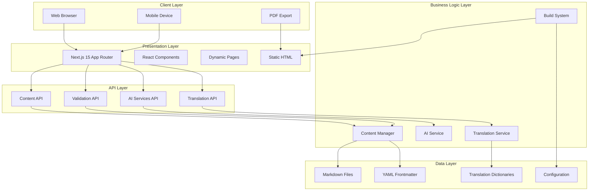

# System Architecture Overview

## 🏗️ High-Level Architecture

The CreateX Facilitator Guide follows a modern, scalable architecture pattern combining static site generation with dynamic API capabilities.



## 🎯 Architectural Principles

### 1. **Content-First Design**
- Markdown as the single source of truth
- Version-controlled content with Git
- Human-readable and editable content format
- Metadata-driven organization

### 2. **API-Driven Architecture**
- RESTful API design principles
- Consistent error handling and responses
- OpenAPI-compatible endpoint structure
- Stateless service design

### 3. **Progressive Enhancement**
- Static HTML as baseline experience
- JavaScript enhancement for interactivity
- Graceful degradation for accessibility
- Mobile-first responsive design

### 4. **Modular Component Design**
- Reusable React components
- Separation of concerns
- Testable and maintainable code
- TypeScript for type safety

### 5. **Multi-Channel Output**
- Web application for interactive use
- Static HTML for offline access
- PDF export for print materials
- API access for third-party integration

## 🔧 Technology Stack

### Core Framework
```yaml
Frontend:
  - Next.js 15 (App Router)
  - React 18
  - TypeScript 5.x
  - Tailwind CSS

Content Processing:
  - gray-matter (YAML frontmatter)
  - remark (Markdown processing)
  - remark-html (HTML conversion)
  - remark-gfm (GitHub Flavored Markdown)

Build Tools:
  - Node.js CLI tools
  - Custom static site generator
  - Express.js for preview server
  - ESLint + Prettier for code quality
```

### Development Tools
```yaml
Package Management:
  - npm/yarn workspaces
  - Monorepo structure with Turbo

Development:
  - Next.js Dev Server
  - Hot reloading
  - TypeScript compilation
  - Real-time content validation

Testing:
  - Jest (unit testing)
  - Cypress (e2e testing)
  - Content validation pipeline
  - API endpoint testing
```

## 📊 System Capabilities

### Content Management
- **Create**: New modules via markdown files
- **Read**: Content retrieval via API and static generation
- **Update**: File-based editing with live reload
- **Delete**: Content removal with dependency checking
- **Validate**: Content structure and quality validation
- **Search**: Full-text search across all content
- **Translate**: Multi-language content support

### AI Integration
- **Content Generation**: Exercise and assessment creation
- **Content Enhancement**: Improving clarity and engagement
- **Translation Assistance**: AI-powered translation support
- **Quality Checking**: Automated content validation
- **Personalization**: Adaptive content recommendations

### Build System
- **Static Generation**: Complete HTML site generation
- **Dynamic Serving**: API-powered content delivery
- **Multi-Format Export**: HTML, PDF, and JSON outputs
- **Development Server**: Live preview with hot reload
- **Production Build**: Optimized assets and caching

## 🔄 Data Flow Architecture

### Content Creation Flow
```
1. Author creates/edits Markdown file
2. gray-matter parses frontmatter metadata
3. remark processes content to HTML
4. Content Manager validates structure
5. API serves processed content
6. UI renders final presentation
```

### Content Consumption Flow
```
1. User requests content via URL
2. Next.js router matches dynamic route
3. API endpoint processes request
4. Content Manager retrieves and processes content
5. Component renders with data
6. Browser displays final content
```

### Build Process Flow
```
1. Build system scans content directory
2. Processes all markdown files
3. Generates navigation structure
4. Creates static HTML pages
5. Builds search index
6. Optimizes assets and generates manifest
```

## 🚀 Scalability Considerations

### Performance
- **Static Generation**: Pre-built HTML for fastest loading
- **API Caching**: Intelligent caching of processed content
- **Lazy Loading**: Component and content lazy loading
- **Asset Optimization**: Minimized CSS/JS bundles

### Maintainability
- **Modular Architecture**: Clear separation of concerns
- **TypeScript**: Type safety and better IDE support
- **Component Reusability**: DRY principles throughout
- **Documentation**: Comprehensive inline and external docs

### Extensibility
- **Plugin Architecture**: Easy addition of new features
- **API Extensibility**: RESTful design for third-party integration
- **Content Types**: Flexible metadata schema
- **Output Formats**: Multiple export options

## 🔐 Security Architecture

### Content Security
- Input validation for all user content
- XSS protection through React's built-in escaping
- Content Security Policy headers
- Sanitized HTML output

### API Security
- Rate limiting on API endpoints
- Input validation and sanitization
- Error handling without information leakage
- CORS configuration for appropriate origins

### Build Security
- Dependency vulnerability scanning
- Secure build pipeline
- Content validation before deployment
- Environment variable management

---

*This architecture supports the current implementation and provides a foundation for future enhancements and scaling.*
