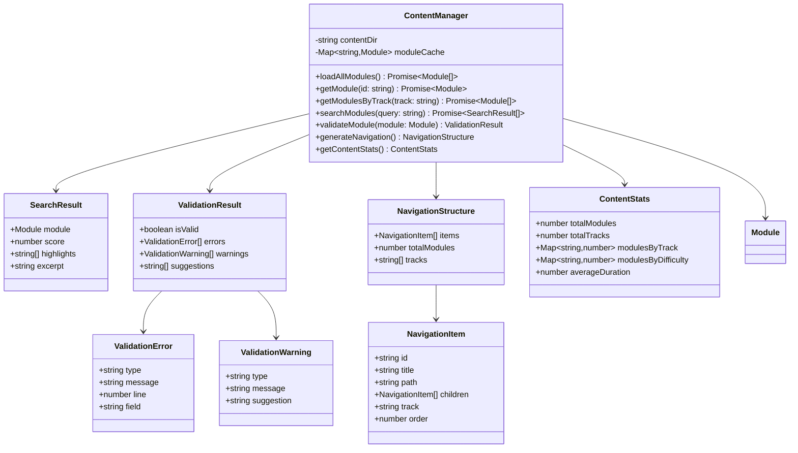
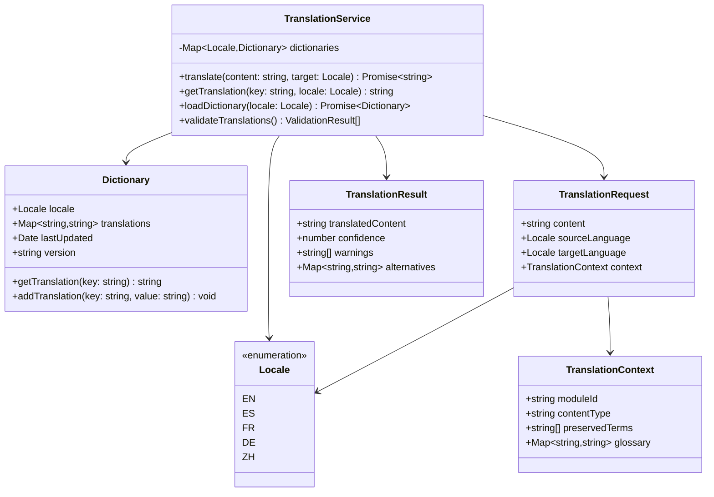
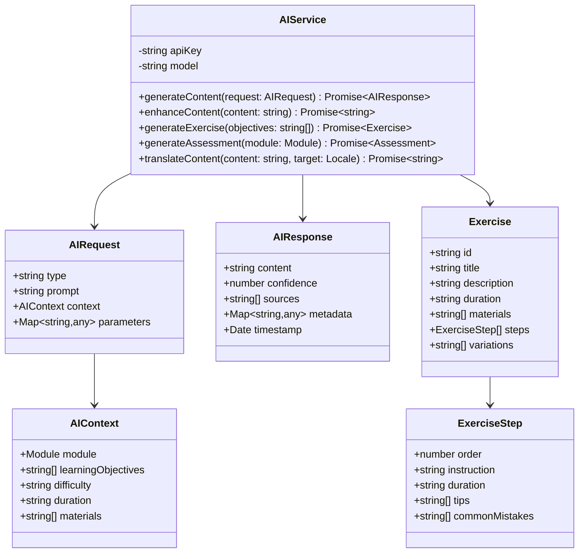
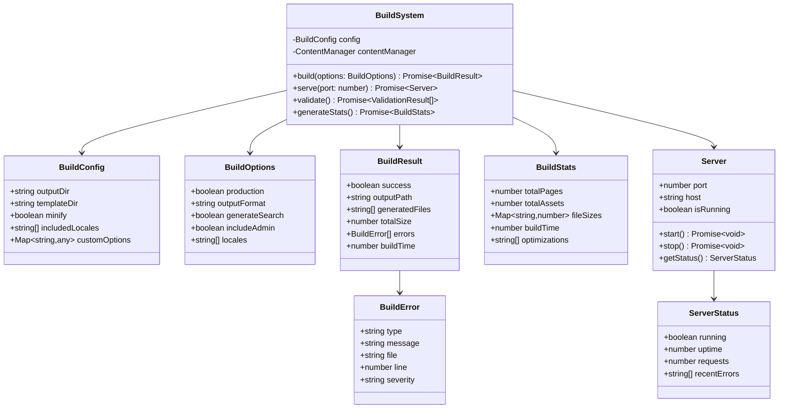

# UML Class Diagrams

## 📊 Core Domain Model

### Content Management Domain

```mermaid
classDiagram
    class Module {
        +string id
        +number chapter
        +string title
        +string track
        +string duration
        +string difficulty
        +string[] prerequisites
        +string[] learningObjectives
        +string content
        +ModuleMetadata metadata
        +validate() boolean
        +toHTML() string
        +translate(locale: Locale) Module
    }

    class ModuleMetadata {
        +string author
        +Date lastModified
        +string version
        +string[] tags
        +number estimatedTime
        +string[] materials
        +Assessment[] assessments
    }

    class Assessment {
        +string id
        +string type
        +string title
        +Question[] questions
        +Rubric rubric
        +number maxScore
    }

    class Question {
        +string id
        +string type
        +string text
        +string[] options
        +string correctAnswer
        +number points
    }

    class Rubric {
        +string[] criteria
        +RubricLevel[] levels
        +string description
    }

    class RubricLevel {
        +string name
        +number score
        +string description
    }

    class Track {
        +string id
        +string name
        +string description
        +Module[] modules
        +string[] prerequisites
        +number totalDuration
    }

    Module ||--|| ModuleMetadata
    ModuleMetadata ||--o{ Assessment
    Assessment ||--o{ Question
    Assessment ||--|| Rubric
    Rubric ||--o{ RubricLevel
    Track ||--o{ Module
```

### Content Management System



### Translation System



### AI Integration System



### Build System



## 🎯 Key Design Patterns

### 1. **Factory Pattern**
Used in `ContentManager` for creating different types of content objects based on frontmatter metadata.

### 2. **Strategy Pattern**
Implemented in `AIService` for different content generation strategies (exercise, assessment, enhancement).

### 3. **Observer Pattern**
Used in build system for watching file changes and triggering rebuilds.

### 4. **Command Pattern**
CLI tools implement command pattern for different build operations.

### 5. **Repository Pattern**
`ContentManager` acts as a repository for content access, abstracting file system operations.

## 🔗 Relationships and Dependencies

### Core Dependencies
- `Module` is the central entity that all other services operate on
- `ContentManager` orchestrates all content operations
- `TranslationService` and `AIService` are independent but can be composed
- `BuildSystem` depends on `ContentManager` and can use translation/AI services

### Data Flow
1. Raw markdown files → `ContentManager` → `Module` objects
2. `Module` objects → `TranslationService` → Localized content
3. `Module` objects → `AIService` → Enhanced/generated content
4. Processed content → `BuildSystem` → Static HTML output

### Error Handling
- Each service implements comprehensive error handling
- Validation results provide structured error information
- Build system aggregates errors from all services
- API layer translates internal errors to HTTP responses

---

*These class diagrams provide a comprehensive view of the system's object-oriented design and relationships.*
