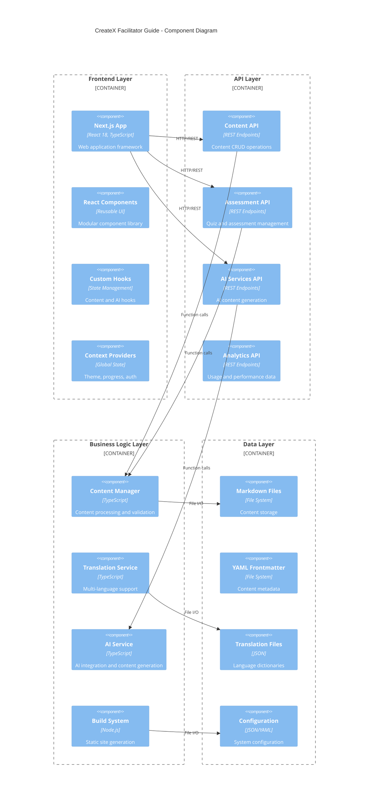
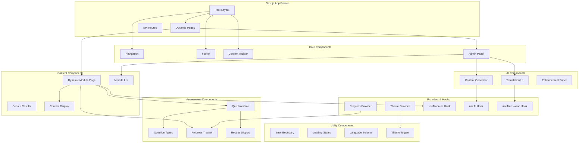
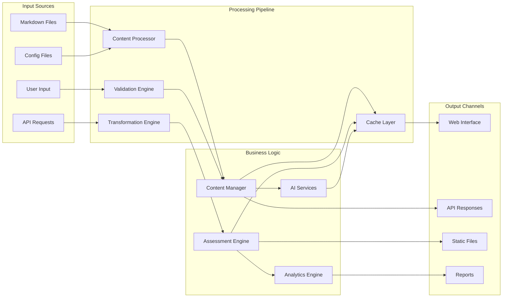
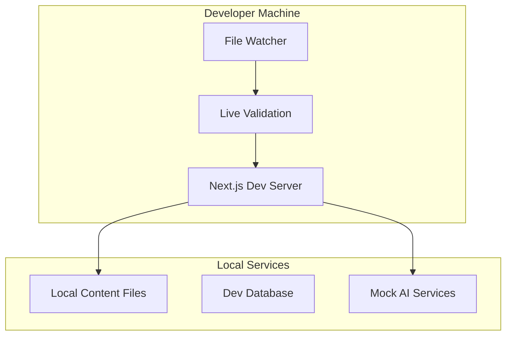
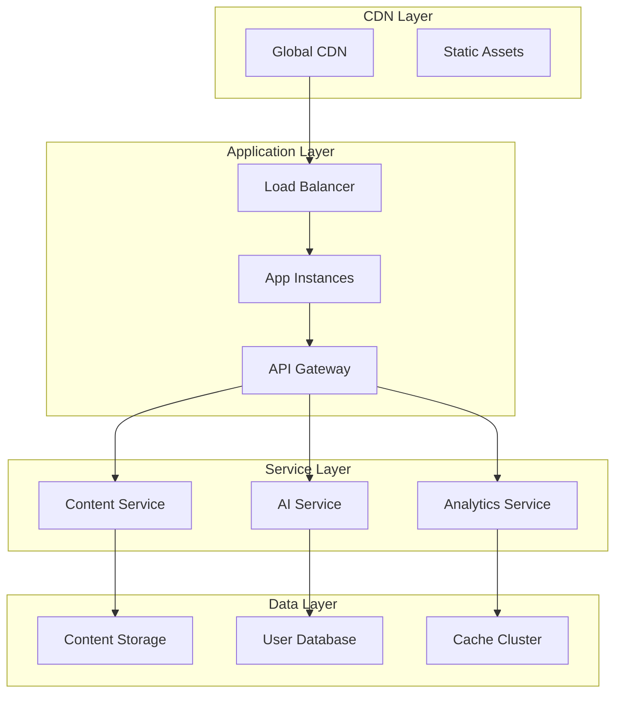

# UML Component Diagrams

## 🏗️ System Component Architecture

### High-Level Component Overview



### Frontend Component Architecture



### API Component Structure

```mermaid
graph TB
    subgraph "API Gateway Layer"
        Router[Next.js API Router]
        Middleware[Request Middleware]
        Auth[Authentication]
        RateLimit[Rate Limiting]
    end

    subgraph "Content API Module"
        ContentController[Content Controller]
        ContentValidation[Content Validation]
        ContentSerialization[Content Serialization]
    end

    subgraph "Assessment API Module"
        AssessmentController[Assessment Controller]
        QuizEngine[Quiz Engine]
        ScoreCalculation[Score Calculation]
        ProgressTracking[Progress Tracking]
    end

    subgraph "AI API Module"
        AIController[AI Controller]
        ContentGeneration[Content Generation]
        TranslationEngine[Translation Engine]
        EnhancementEngine[Enhancement Engine]
    end

    subgraph "Analytics API Module"
        AnalyticsController[Analytics Controller]
        DataAggregation[Data Aggregation]
        ReportGeneration[Report Generation]
        MetricsCollection[Metrics Collection]
    end

    subgraph "Shared Components"
        ErrorHandler[Error Handler]
        Logger[Request Logger]
        CacheManager[Cache Manager]
        ValidationSchemas[Validation Schemas]
    end

    Router --> Middleware
    Middleware --> Auth
    Middleware --> RateLimit
    
    Router --> ContentController
    Router --> AssessmentController
    Router --> AIController
    Router --> AnalyticsController
    
    ContentController --> ContentValidation
    ContentController --> ContentSerialization
    
    AssessmentController --> QuizEngine
    AssessmentController --> ScoreCalculation
    AssessmentController --> ProgressTracking
    
    AIController --> ContentGeneration
    AIController --> TranslationEngine
    AIController --> EnhancementEngine
    
    AnalyticsController --> DataAggregation
    AnalyticsController --> ReportGeneration
    AnalyticsController --> MetricsCollection
    
    ContentController --> ErrorHandler
    AssessmentController --> ErrorHandler
    AIController --> ErrorHandler
    AnalyticsController --> ErrorHandler
    
    ContentController --> Logger
    AssessmentController --> Logger
    AIController --> Logger
    AnalyticsController --> Logger
    
    ContentController --> CacheManager
    AssessmentController --> CacheManager
    
    ContentValidation --> ValidationSchemas
    QuizEngine --> ValidationSchemas
```



### Service Layer Architecture

```mermaid
graph TB
    subgraph "Content Management Services"
        ContentManager[Content Manager]
        FileProcessor[File Processor]
        MetadataParser[Metadata Parser]
        ContentValidator[Content Validator]
        SearchIndexer[Search Indexer]
    end

    subgraph "AI Integration Services"
        AIServiceFacade[AI Service Facade]
        OpenAIClient[OpenAI Client]
        ContentGenerator[Content Generator]
        TranslationService[Translation Service]
        EnhancementService[Enhancement Service]
    end

    subgraph "Assessment Services"
        AssessmentManager[Assessment Manager]
        QuizProcessor[Quiz Processor]
        GradingEngine[Grading Engine]
        ProgressCalculator[Progress Calculator]
        AnalyticsProcessor[Analytics Processor]
    end

    subgraph "Build & Deployment Services"
        StaticSiteGenerator[Static Site Generator]
        TemplateEngine[Template Engine]
        AssetOptimizer[Asset Optimizer]
        DeploymentManager[Deployment Manager]
    end

    subgraph "Utility Services"
        FileSystemManager[File System Manager]
        ConfigurationManager[Configuration Manager]
        CacheService[Cache Service]
        LoggingService[Logging Service]
        ErrorReporter[Error Reporter]
    end

    ContentManager --> FileProcessor
    ContentManager --> MetadataParser
    ContentManager --> ContentValidator
    ContentManager --> SearchIndexer
    
    AIServiceFacade --> OpenAIClient
    AIServiceFacade --> ContentGenerator
    AIServiceFacade --> TranslationService
    AIServiceFacade --> EnhancementService
    
    AssessmentManager --> QuizProcessor
    AssessmentManager --> GradingEngine
    AssessmentManager --> ProgressCalculator
    AssessmentManager --> AnalyticsProcessor
    
    StaticSiteGenerator --> TemplateEngine
    StaticSiteGenerator --> AssetOptimizer
    StaticSiteGenerator --> DeploymentManager
    
    ContentManager --> FileSystemManager
    ContentManager --> ConfigurationManager
    ContentManager --> CacheService
    
    AIServiceFacade --> LoggingService
    AIServiceFacade --> ErrorReporter
    
    AssessmentManager --> CacheService
    AssessmentManager --> LoggingService
    
    StaticSiteGenerator --> FileSystemManager
    StaticSiteGenerator --> ConfigurationManager
```



### Data Flow Component Diagram



## 🔧 Component Interfaces and Dependencies

### Content Manager Interface
```typescript
interface IContentManager {
  // Core content operations
  loadAllModules(): Promise<Module[]>
  getModule(id: string): Promise<Module | null>
  saveModule(module: Module): Promise<void>
  deleteModule(id: string): Promise<void>
  
  // Search and filtering
  searchModules(query: string): Promise<SearchResult[]>
  getModulesByTrack(track: string): Promise<Module[]>
  
  // Validation and quality
  validateModule(module: Module): ValidationResult
  getContentStats(): ContentStats
  generateNavigation(): NavigationStructure
}
```

### AI Service Interface
```typescript
interface IAIService {
  // Content generation
  generateContent(request: AIRequest): Promise<AIResponse>
  enhanceContent(content: string, options: EnhancementOptions): Promise<string>
  
  // Specialized generation
  generateExercise(objectives: string[], context: AIContext): Promise<Exercise>
  generateAssessment(module: Module): Promise<Assessment>
  
  // Translation and improvement
  translateContent(content: string, targetLang: Locale): Promise<string>
  suggestImprovements(content: string): Promise<Suggestion[]>
}
```

### Assessment Manager Interface
```typescript
interface IAssessmentManager {
  // Assessment management
  createAssessment(assessment: Assessment): Promise<string>
  getAssessment(id: string): Promise<Assessment | null>
  updateAssessment(id: string, assessment: Assessment): Promise<void>
  
  // Attempt management
  startAttempt(assessmentId: string, userId: string): Promise<AttemptSession>
  submitAttempt(attempt: AssessmentAttempt): Promise<AttemptResult>
  
  // Progress and analytics
  getUserProgress(userId: string): Promise<ProgressData>
  getAssessmentAnalytics(assessmentId: string): Promise<AnalyticsData>
}
```

### Build System Interface
```typescript
interface IBuildSystem {
  // Build operations
  build(options: BuildOptions): Promise<BuildResult>
  watch(callback: (changes: FileChange[]) => void): void
  serve(port: number): Promise<Server>
  
  // Validation and optimization
  validate(): Promise<ValidationResult[]>
  optimize(): Promise<OptimizationResult>
  deploy(target: DeploymentTarget): Promise<DeploymentResult>
}
```

## 🔗 Component Dependencies

### Frontend Dependencies
```yaml
Primary Dependencies:
  - Next.js 15 (App Router)
  - React 18 (UI Library)
  - TypeScript 5 (Type Safety)
  - Tailwind CSS (Styling)

Secondary Dependencies:
  - Lucide React (Icons)
  - React Hook Form (Form Management)
  - Framer Motion (Animations)
  - React Query (Data Fetching)
```

### Backend Dependencies
```yaml
Core Libraries:
  - gray-matter (Frontmatter Parsing)
  - remark (Markdown Processing)
  - remark-html (HTML Conversion)
  - remark-gfm (GitHub Flavored Markdown)

Utility Libraries:
  - chalk (CLI Styling)
  - commander (CLI Framework)
  - express (Preview Server)
  - chokidar (File Watching)
```

### AI Integration Dependencies
```yaml
AI Services:
  - OpenAI API (Content Generation)
  - Azure Cognitive Services (Translation)
  - Hugging Face Transformers (Local AI)

Processing Libraries:
  - natural (Text Processing)
  - compromise (NLP)
  - sentiment (Sentiment Analysis)
```

## 📦 Component Deployment Model

### Development Environment


### Production Environment


---

*These component diagrams provide a comprehensive view of the system's modular architecture and component relationships.*
