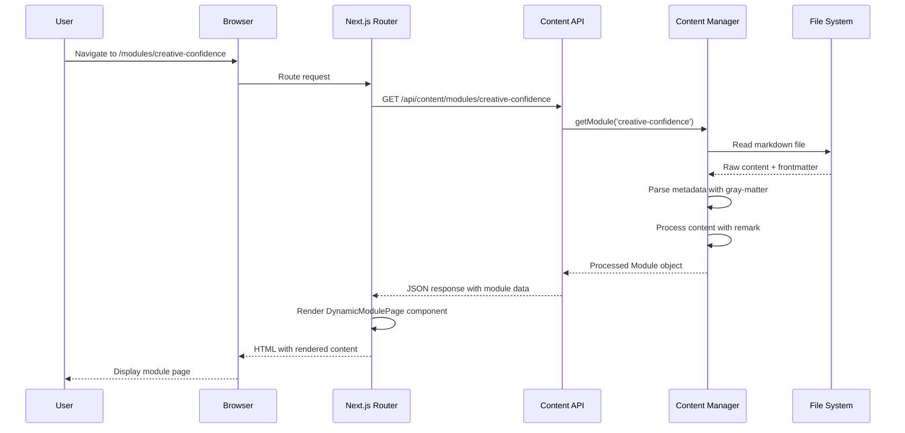
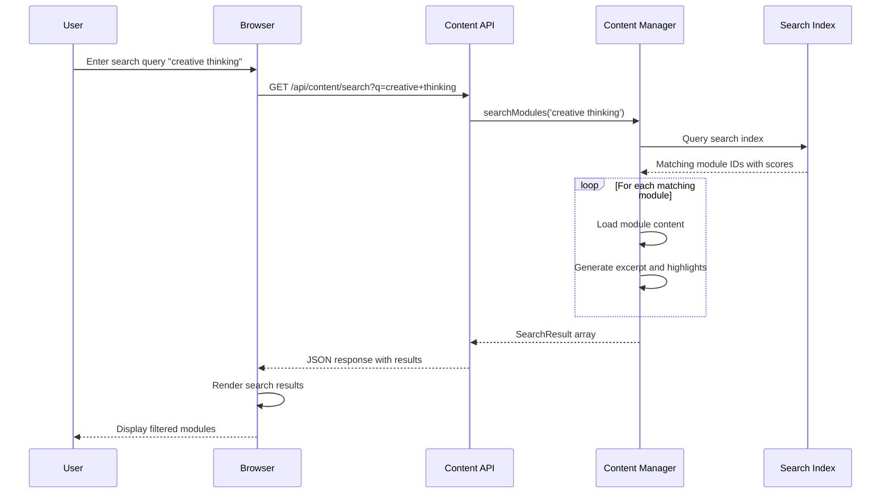
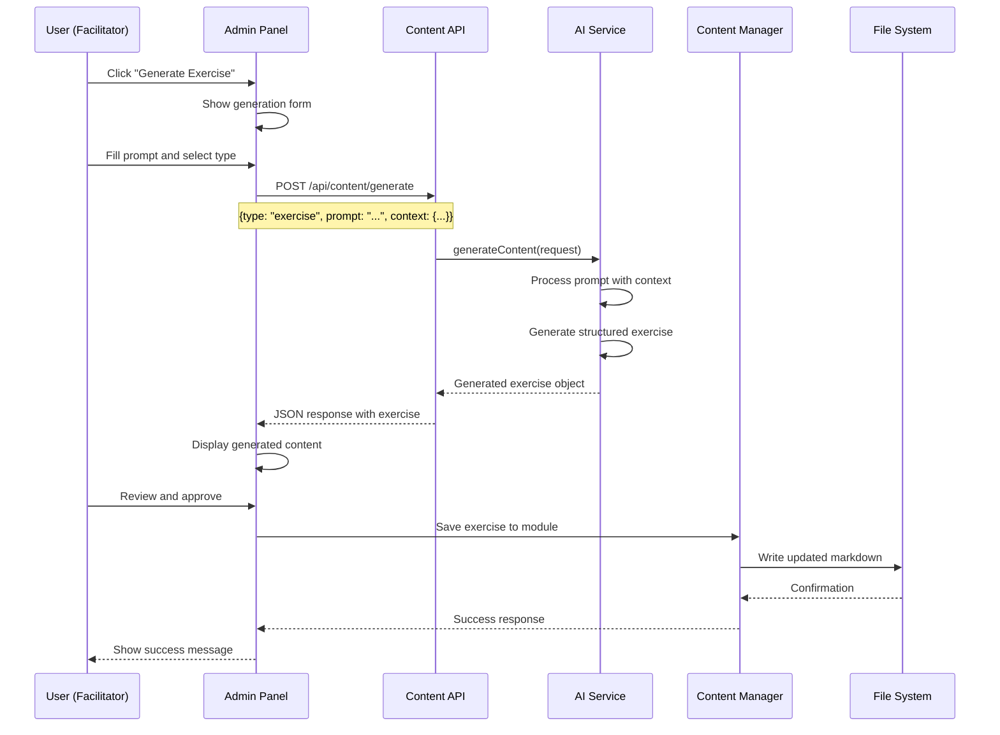
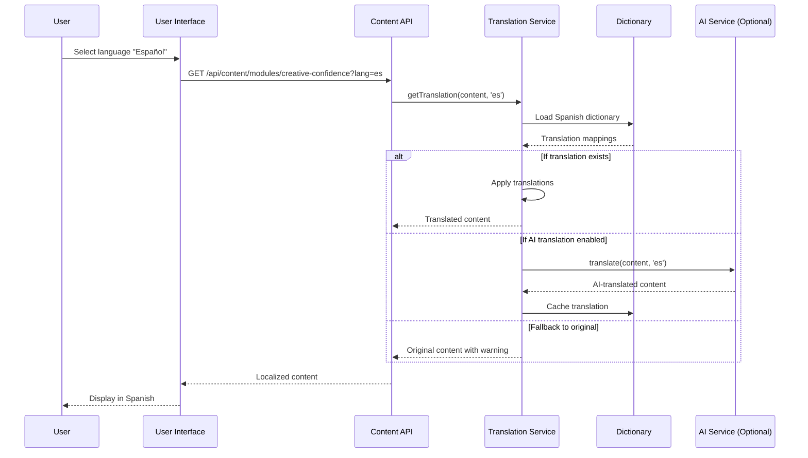
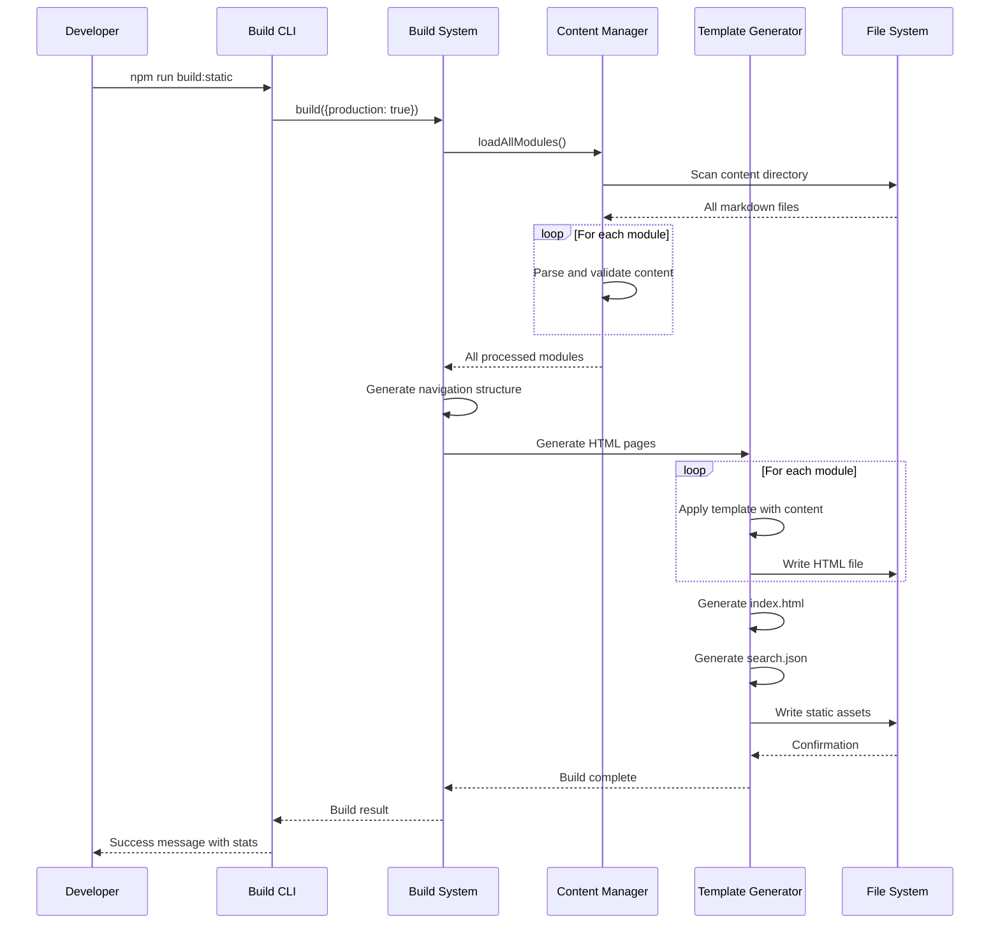
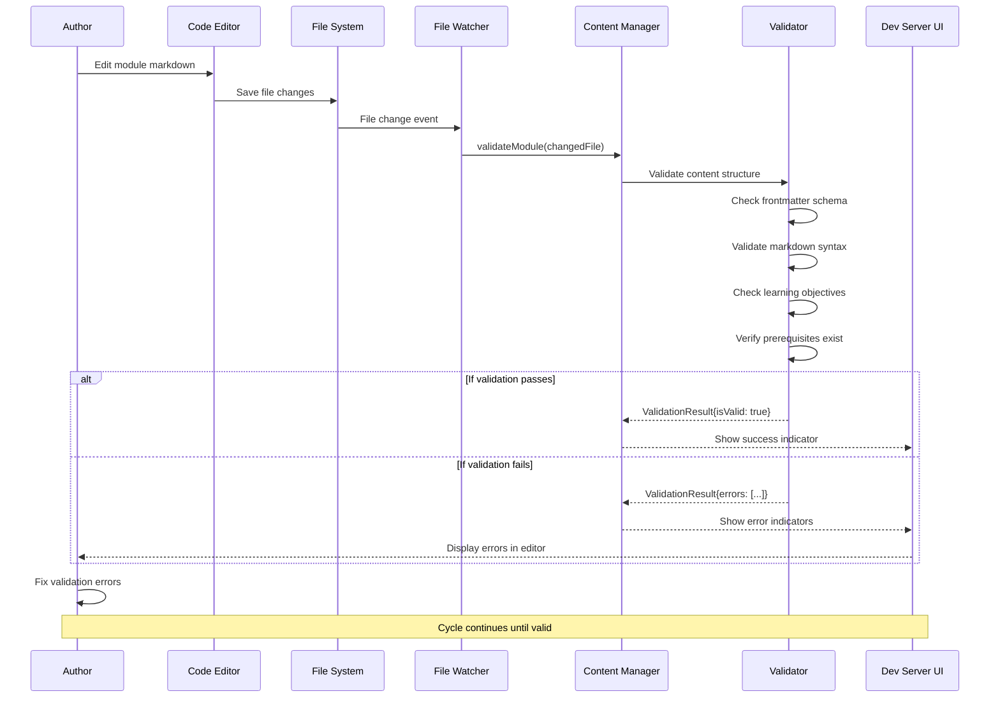
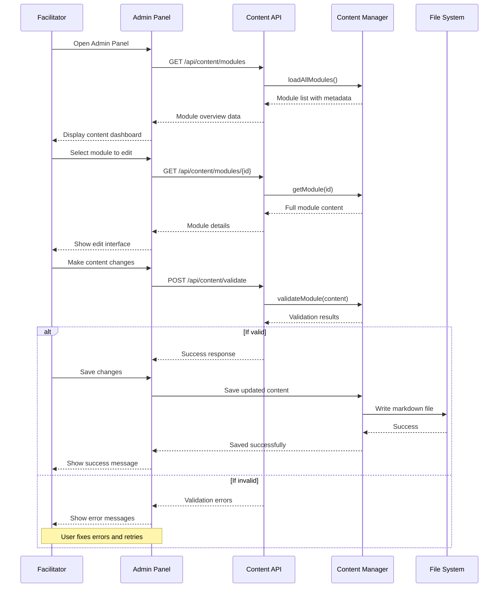
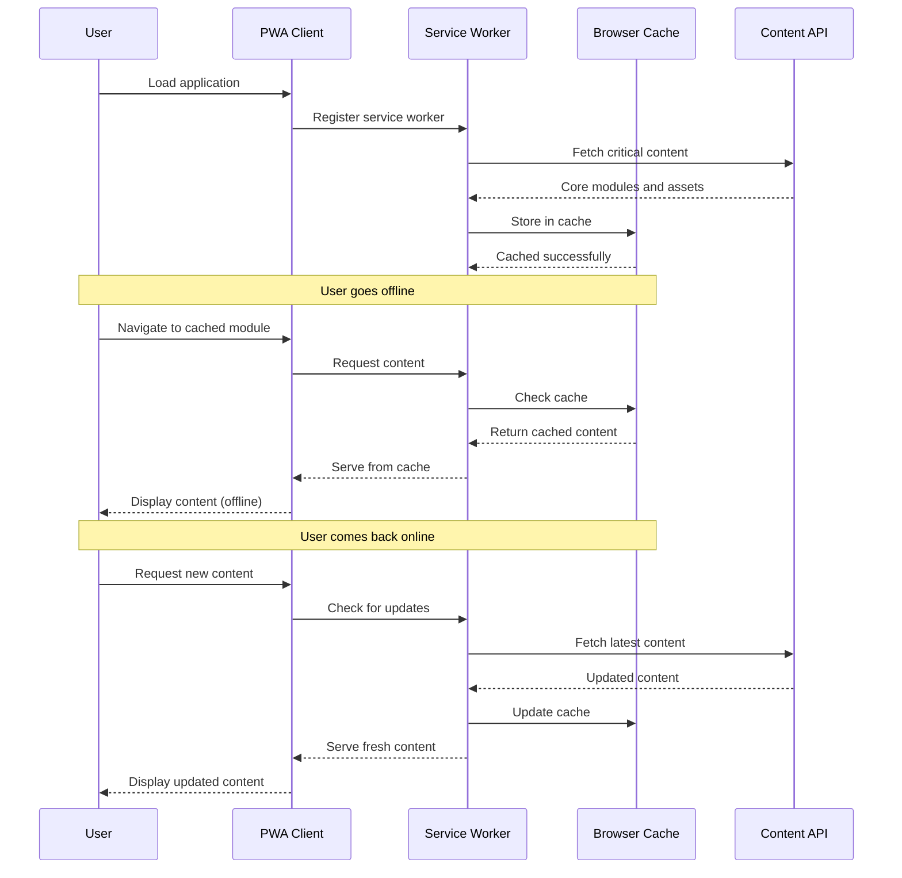
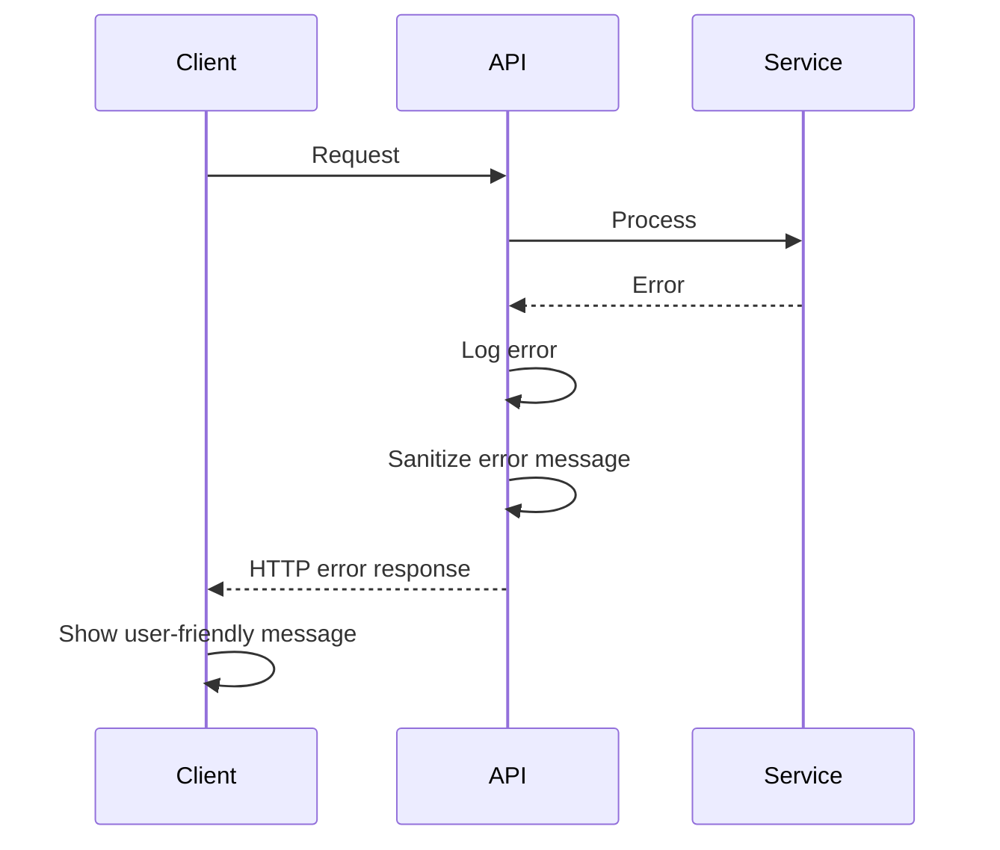
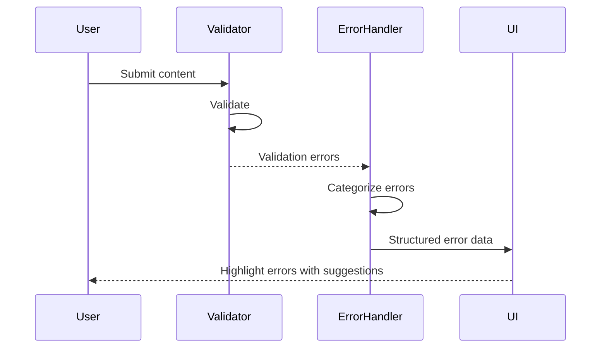

# UML Sequence Diagrams

## 🔄 System Interaction Flows

### 1. Content Loading and Display

### 2. Content Search Flow

### 3. AI Content Generation

### 4. Multi-Language Translation

### 5. Static Site Build Process

### 6. Content Validation Workflow

### 7. Admin Panel Content Management

### 8. Progressive Web App Offline Support

## 🎯 Key Interaction Patterns

### 1. **Request-Response Pattern**
Most API interactions follow a simple request-response pattern with proper error handling and validation.

### 2. **Event-Driven Updates**
File watching and real-time validation use event-driven patterns for responsive development experience.

### 3. **Caching Strategy**
Multiple levels of caching (browser, service worker, API) ensure optimal performance.

### 4. **Graceful Degradation**
All interactions have fallback mechanisms for offline or error scenarios.

### 5. **Validation Pipeline**
Content validation happens at multiple stages to ensure quality and consistency.

## 🔄 Error Handling Flows

### API Error Handling

### Content Validation Error Flow

---

*These sequence diagrams illustrate the dynamic behavior and interactions within the CreateX Facilitator Guide system.*
